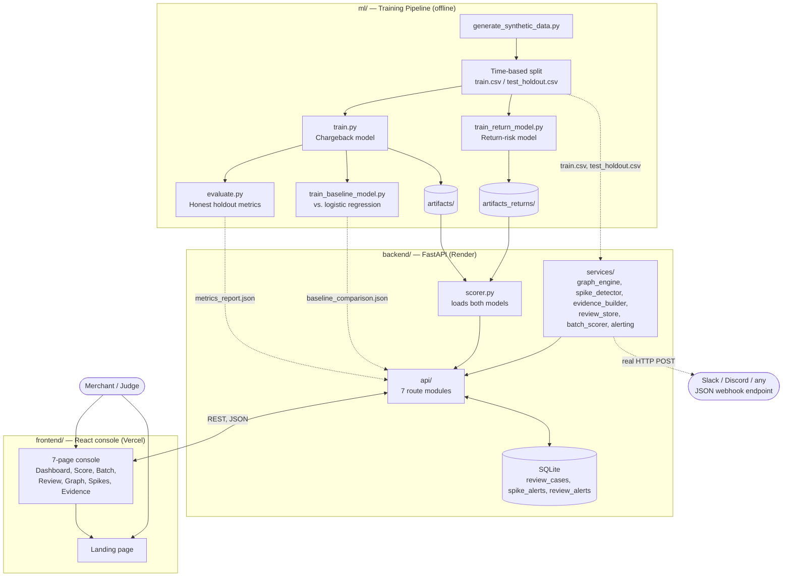
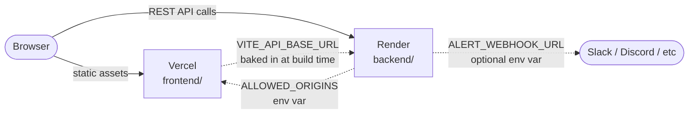

# Architecture

A fast, accurate map of how this system fits together — for a judge
skimming this in a few minutes, or for us six months from now.

## The elevator pitch

Two independently-trained models (chargeback risk, return risk) serve a
FastAPI backend, which powers a React console covering all four of the
track's named directions: return-risk scoring, chargeback evidence,
abuse-ring detection, and fraud-spike monitoring — plus real webhook
alerting (proven live against Slack, not just built) and a policy
simulator that turns the model's cost math into a live ₹-per-month
figure. Backend runs on Render (needs a persistent, always-on process
— see "Why not one platform for everything" below); frontend runs on
Vercel.

## System diagram



## Three layers

### 1. `ml/` — training pipeline (runs offline, not on request)

Nothing in here runs at request time. It's a one-time (or periodic)
process that produces the artifacts the backend loads from disk.

| Script | Produces | Notes |
|---|---|---|
| `generate_synthetic_data.py` | `data/raw/orders.csv` | 20K orders, embedded abuse rings, a deliberate 90-day tactic-drift window |
| `train.py` | `artifacts/`, `data/train.csv`, `data/test_holdout.csv` | Chargeback model. Time-based split — never random shuffle |
| `evaluate.py` | `reports/metrics_report.json` | Full threshold sweep, cost-weighted optimum, drift analysis |
| `train_return_model.py` | `artifacts_returns/` | **Separate model**, own leakage guards (`chargeback` excluded), own empirical risk bands |
| `train_baseline_model.py` | `reports/baseline_comparison.json` | XGBoost vs. logistic regression — reported honestly even where the baseline wins |
| `explain.py` | (imported, not run standalone) | `RiskExplainer` class — used by both models, SHAP-backed |
| `tests/` | — | 49 tests: split integrity, leakage guards (both directions), cost-math correctness, baseline methodology |

**Why two models, not one:** early on, "return-risk scoring" was
implied by the chargeback model alone. `train_return_model.py` makes it
literally true — trained independently on the `returned` label, with
`chargeback` excluded as a leakage feature the same way `returned` is
excluded from the chargeback model. They frequently disagree on the
same order (see [`backend/ml/docs/metrics_report.md`](../backend/ml/docs/metrics_report.md) for a
measured example) — proof they're not redundant.

### 2. `backend/` — FastAPI (always-on, Render)

```
app/
├── api/        7 route modules — score, batch, review_queue, metrics, graph, spikes, evidence
├── services/   Business logic — one file per concern, each independently testable
├── models/     Pydantic schemas (API contract) + 3 SQLAlchemy ORM models
└── db/         SQLite engine/session, table creation on startup
```

**Request flow for `POST /score`** (the core operation):
1. `api/score.py` receives `OrderInput`, calls `services/scorer.py`
2. `scorer.py` runs the order through **both** `RiskExplainer` instances
   (chargeback + return), each returning a score, SHAP-backed reasons,
   and a risk band
3. Chargeback band uses fixed thresholds (0.25/0.6); return band uses
   thresholds computed from that model's own holdout distribution
   (loaded from `artifacts_returns/train_holdout_meta.json`) — the two
   models' score distributions aren't comparable, so sharing thresholds
   would misclassify most return scores
4. Response returns both risk profiles in one `ScoreResult`

**Why SQLite, not in-memory:** the review queue originally reset on
every server restart. `db/database.py` + `models/db_models.py` give it
a real audit trail — `GET /review/resolved` survives a restart, proven
by reading the raw `.db` file with zero server process running during
testing.

**Three real bugs worth knowing the reasoning behind**, since they shaped
the architecture:
- **Evidence PDFs / batch CSVs download via explicit `FileResponse(...,
  filename=...)` routes**, not a generic `StaticFiles` mount — a plain
  static mount serves files inline with no `Content-Disposition`
  header, which caused generated files to open in-browser instead of
  downloading. Fixed once, applied consistently to both file-serving
  routes.
- **`graph_engine.py` requires shared identifiers to cluster within a
  10-day window**, not just "any shared device/address." At 20K+
  orders, the synthetic dataset's finite device/address pools produce
  incidental collisions between *unrelated* customers by chance — an
  earlier naive version produced one 28,000-node blob instead of real
  rings. The time-window constraint mirrors how the generator actually
  builds its deliberate rings.
- **`config.ALERT_WEBHOOK_URL` must be referenced via the module
  (`import app.config as config`), never via `from app.config import
  ALERT_WEBHOOK_URL`.** The latter captures a snapshot at import time —
  it looked fine for months because no `.env` file existed yet, so the
  snapshot and the live value always happened to coincidentally match
  ("" both ways). The moment a real `.env` value existed, `alerting.py`
  and `spikes.py` each held their own frozen copy from whenever they
  were first imported, silently diverging from the actual current
  config. A real, live-reproduced Python import gotcha, not a
  hypothetical one — caught by a test that failed only once a genuine
  `.env` file was present during a full suite run.

**Two services compose others, not just the API layer directly:**
`evidence_builder.py` calls both `scorer.py` (to re-score the order
live, at packet-generation time) and `graph_engine.py` (to check ring
membership) — the evidence packet isn't a separate, disconnected
feature, it's built *from* the same signals the rest of the app
produces. And `graph_engine.py` itself serves two different callers
from one cached computation: `build_graph()` caps the ring list at 60
for the visualization payload, while `find_customer_ring()` searches
the *full*, uncapped set for the evidence packet's network check — a
customer's ring could rank outside the graph UI's top 60 by severity
and still be a real, relevant finding for one specific order.

### 3. `frontend/` — React console (static, Vercel)

`/` is the marketing landing page; `/app/*` is the console
(`AppShell` sidebar + 7 pages). Every page fetches from the backend
with real loading/error/empty states — no mock data fallbacks, so a
backend outage shows a genuine error, not a silently broken UI.

**The ROC curve, confusion matrix, and policy simulator all needed zero
backend changes.** `/metrics` already returns a full threshold sweep
with `tp`/`fp`/`fn`/`tn` counts at 19 points — the ROC curve computes
TPR/FPR from those same counts client-side, the confusion matrix reads
one point from the same array, and the policy simulator recomputes
projected ₹ savings live as the threshold slider moves, all from data
already being served. Deliberately reused rather than growing the API
surface for something the frontend could derive on its own.

Design system: dark "risk console" aesthetic, CSS variables as the
single source of truth (`styles/tokens.css`), Tailwind mapped onto the
same variables. `Panel` — the shared card component used on every
console page — wraps `CardSpotlight` (WebGL mouse-tracking spotlight),
applied once at the component level rather than per-page.

## Deployment topology



### Why not one platform for everything

Vercel's serverless functions have an ephemeral filesystem — every
invocation can run on a different instance with no shared disk. This
backend depends on:
- **SQLite persistence** (the audit trail would silently reset)
- **Generated files on disk** (a PDF created on one invocation may not
  exist when the download request hits a different instance)
- **In-memory model singletons** (`scorer.py` loads both models once
  per process; serverless cold starts would reload them repeatedly)

Render runs the backend as a normal always-on container, so all three
assumptions hold. See [`DEPLOYMENT.md`](../DEPLOYMENT.md) for the full setup, including two
honest platform caveats (free-tier cold starts, free-tier disk not
guaranteed to persist across redeploys).

## Where this would need to change for real production use

Stated plainly, not glossed over:
- **No authentication** on any endpoint.
- **SQLite is single-instance** — would need Postgres (or similar)
  before running multiple backend replicas behind a load balancer.
- **Batch scoring is synchronous** and capped at 5,000 rows — a real
  version would want a background job queue for larger files.
- **No automated tests on the frontend** — 103 tests cover the ML
  pipeline and every backend API route, but the React console itself
  has no Vitest/Playwright suite; every page was verified by hand
  (`tsc`/build on every change, plus manual click-through against a
  live backend) rather than an automated regression suite. Worth
  adding first if this goes further.
